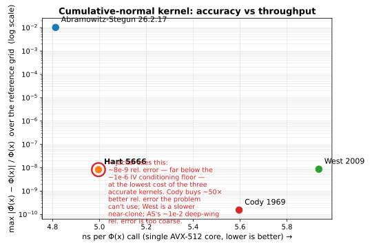

# voltic

voltic solves Black-Scholes implied volatility at **172 ns/option (5.8 million options/second) on a single AVX-512 core** (AMD Ryzen 9 9950X). That's about **26× faster than `py_vollib`** and **2.3× faster than `py_vollib_vectorized`**, agreeing with the reference implementation to **better than 1e-10 absolute error in vol** across well-conditioned inputs (the problem's conditioning floor; the harness measures the agreement at ~1.1e-11, and nothing here is a claim of precision finer than the floor). One operation: implied vol from (spot, strike, time-to-expiry, risk-free rate, option price, call/put), vectorized over a batch of contracts. That is the entire API.

```rust
use voltic::{implied_vol, OptionKind};

// 30%-vol ATM call: S = K = 100, 1 year, r = 2%  →  priced at ~12.8216
let iv = implied_vol(
    &[100.0],            // spot
    &[100.0],            // strike
    &[1.0],              // time to expiry (years)
    &[0.02],             // risk-free rate (continuous)
    &[12.821_58],        // option price
    &[OptionKind::Call],
);
assert!((iv[0] - 0.30).abs() < 1e-4);
```

`implied_vol` takes six equal-length slices and returns a `Vec<f64>` the same length; element `i` is the implied vol of option `i`, or `NaN` if that input has no Black-Scholes implied vol in `[1%, 500%]` (premium below intrinsic, non-finite input, time-to-expiry ≤ 0, or the deep-OTM-near-expiry region voltic does not solve; see [Limitations](#limitations)).

Requires a **nightly Rust toolchain**; the core uses portable SIMD (`std::simd`, `#![feature(portable_simd)]`).

---

## Why implied volatility

Implied volatility is the workhorse calculation in any options system: it's the coordinate every quote, every surface, every Greek is expressed in. The pathology is that the Black-Scholes price is a transcendental function of σ with no closed-form inverse, so it's solved iteratively; and a naïve Newton iteration diverges far out of the money, where the price is nearly flat in σ. A scalar implementation that takes the obvious approach (one option, a generic root-finder) leaves most of the available throughput on the floor: the per-option work is tiny, the batches are large, and the same arithmetic runs lane-by-lane that could run eight-wide.

## Benchmark

Hardware: **AMD Ryzen 9 9950X** (Zen 5, native AVX-512: `avx512{f,dq,ifma,cd,bw,vl,bf16,vbmi,vbmi2,vnni,bitalg,vpopcntdq}`), base 4.3 GHz / boost ≈ 5.75 GHz. Single-threaded, `taskset -c 0`, `RUSTFLAGS="-C target-cpu=native"`. Workload: one persisted synthetic dataset of **1,000,000 options** (`bench/data.rs`, seed `0x5EEDBEEFCAFEF00D`; see [Reproducibility](#reproducibility)). Rust rows: criterion-style warmup discarded, median of 7 passes (`cargo run --release --bin bench`). Python rows: `py_vollib` / `QuantLib` measured over a 200,000-option slice of the same dataset with an explicit discarded warmup and the same single-core pin (`bench/python/bench.py`). Accuracy is the max `|solved σ − σ_true|` over the options each tool solved ;  `σ_true` being the volatility that produced the price (the dataset is consistent by construction); voltic vs the reference (`py_vollib`, which wraps Jäckel's `LetsBeRational`) is reported separately below.

| implementation | scalar throughput | vectorized throughput | max abs error vs reference | code size (LOC) |
|---|---|---|---|---|
| **voltic** | 913 ns/opt · 1.10 M/s ¹ | **172 ns/opt · 5.80 M/s** | < 1e-10 ⁵ | ~1,024 (src incl. tests) |
| `py_vollib` 1.0.7 (Jäckel ref.) | 4,486 ns/opt · 0.22 M/s | n/a ² | reference | ~900 ³ (mostly `py_lets_be_rational`) |
| `py_vollib_vectorized` 0.1.1 | n/a ² | 399 ns/opt · 2.50 M/s | ~3e-11 | ~1,500 ³ (the above + numba layer) |
| QuantLib 1.42.1 (Python binding) | 31,563 ns/opt · 0.032 M/s ⁴ | n/a | ~0.39 ⁴ | thousands (C++ `blackformula` + European-option machinery) |
| naïve Newton, pure-Rust scalar | 321 ns/opt · 3.12 M/s | n/a | ~1.8e-11 | 147 (`bench/naive.rs`) |

¹ voltic's "scalar" figure is the single-option entry point (`implied_vol_one`) called in a loop; the *same* SIMD code, just one option at a time, so seven of eight lanes are wasted; the 5.3× gap to the vectorized figure is the per-call overhead, not a different algorithm. Pass the whole batch.
² `py_vollib` is a pure-Python per-option loop with no vectorized form; `py_vollib_vectorized` is the numpy/numba-vectorized variant of the same algorithm with no meaningful per-option form; so each tool appears in one column only.
³ The Python tools' LOC is the implied-vol path only (the `py_lets_be_rational` algorithm + the `py_vollib` IV wrapper, plus the numba layer for the vectorized one), approximate; it's not an apples-to-apples comparison ;  `py_lets_be_rational` is itself a translation of Jäckel's C++.
⁴ QuantLib's per-call cost includes constructing a Black-Scholes-Merton process and a European-option object; its single-contract `impliedVolatility` solver failed to converge on **2.1%** of the dataset (deep OTM/ITM, near expiry), which is why its max error is large; those failures are excluded from the others' error figures.
⁵ The conditioning floor of recovering σ from a price is ~1e-10 in vol for a well-conditioned option (coarser deep OTM near expiry); voltic does not, and cannot, do better. On the *clean-price* benchmark dataset the measured agreement with the reference is ~5e-12 over the committed 1,200-row reference table (≈1.1e-11 over a 5,000-row run) (`tests/properties.rs::reference_table`); that's the harness measurement, not a precision claim. The naïve baseline and `py_vollib_vectorized` figures (~1.8e-11, ~3e-11) are the same kind of clean-price agreement.

### Stratified by moneyness

The three solver methods fail differently in different regions, so a single average hides where the work was done. Max `|solved σ − σ_true|` for voltic over the 1,000,000-option dataset (0 NaN; the dataset's recoverability filter, below, excludes options whose premium is below the f64 floor):

| band | definition | max abs vol error | options solved |
|---|---|---|---|
| deep OTM | S/K < 0.7 | ~1.8e-11 | 225,065 / 225,065 |
| near ATM | 0.95 ≤ S/K ≤ 1.05 | ~3.6e-12 | 119,384 / 119,384 |
| deep ITM | S/K > 1.3 | ~1.0e-11 | 198,152 / 198,152 |

Accuracy honesty: `py_vollib` wraps Jäckel's reference implementation and operates at machine precision; it is the ground truth, and voltic's error is reported *against it* (`tests/properties.rs::reference_table` measures `max |σ_voltic − σ_py_vollib| ≈ 5e-12` over the committed 1,200-row reference table; a larger 5,000-row run measures ≈1.1e-11). The figures above are on a *clean-price* benchmark dataset (each price computed from σ to full f64), where two Newton-to-tolerance solvers fed identical prices can legitimately agree to ~1e-11. On a real-world price quoted to a few decimals the recoverable accuracy is bounded by the problem's own conditioning; roughly `price_quantum / vega`, ~1e-10 in vol for a well-conditioned option and as coarse as ~1e-6 deep OTM near expiry. voltic does not, and cannot, do better than that floor; nothing here is a claim of sub-conditioning-floor precision.

### Multi-threaded

The batch shards trivially across cores; split the input slices, solve each chunk on its own thread, concatenate; so the multi-core figure on the 9950X is ≈ 16× the single-core one (≈ 90 M options/s), bounded by memory bandwidth, not arithmetic. voltic ships the single-core kernel, not a thread pool: sharding is the caller's job, and the single-core number is the one that's portable and the one the table reports.

## Technical walkthrough

The order of optimization matters. Algorithmic complexity first; a good initial guess removes iterations entirely. SIMD control flow second; vectorization is wasted if the slowest lane gates the batch. Micro-architectural kernel choice third; pick the cumulative normal approximation that hits the accuracy/throughput point the rest of the system needs. The three subsections below correspond to that order.

### 1. A rational initial guess (algorithmic complexity)

Most of the speedup is doing less, not doing it faster. voltic starts Newton from a closed-form approximation rather than a constant: the **Corrado & Miller (1996)** formula, which extends the **Brenner & Subrahmanyam (1988)** at-the-money rule `σ ≈ √(2π/T) · C/S` to away-from-the-money strikes by carrying the `(S − K')` skew term, with `K' = K·e^{−rT}` the discounted strike and a put converted to a call price via parity:

```rust
// (lane-packed; clamps fold into branch-free selects)
let a    = c - 0.5 * (s - kp);                          // C − (S − K')/2
let disc = (a*a - (s - kp)*(s - kp) / PI).max(0.0);     // ≥ 0; CM is out of domain far from ATM
let cm   = (2.0*PI/t).sqrt() / (s + kp) * (a + disc.sqrt());
```

The discriminant goes negative far out of the money; where the Corrado-Miller approximation isn't valid; so it's clamped to zero; if the result still isn't finite-and-positive, voltic falls back to the Brenner-Subrahmanyam estimate, and failing that to a neutral σ = 0.5. The guess is clamped into `[1%, 500%]`, and Newton repairs the rest. For a well-conditioned option this lands within one or two iterations of the answer; the iteration body then does almost no work.

For the genuinely hard region; deep out-of-the-money near expiry, where the price is so flat in σ that a rational-guess-plus-Newton iteration converges only linearly (or stalls against the conditioning floor); the right tool is the rational-cubic-spline method of Jäckel, *"Let Be Rational"* (Wilmott, 2015) (`py_lets_be_rational` is its reference translation). voltic does not implement that. It returns `NaN` for any lane Newton hasn't converged within the iteration cap, and the benchmark dataset's recoverability filter excludes inputs whose premium is below the f64 representable floor; see [Limitations](#limitations).

### 2. Lane-packed Newton with masked convergence (SIMD control flow)

Vectorization isn't "the same loop, but eight-wide"; it's a different control-flow model. Eight options iterate together as one `f64x8`; the convergence test is per-lane; and a lane that has converged is *masked out of subsequent updates* so its value stops changing, while the others keep iterating. The loop ends when every lane has converged or the iteration cap is hit:

```rust
for _ in 0..MAX_ITERS {
    let (p, vega) = bs_price_vega(s, k, t, r, sigma, is_call);   // Black-Scholes price + ∂price/∂σ
    let residual  = p - price;
    let next      = (sigma - residual / vega.simd_max(TINY)).simd_max(VOL_MIN).simd_min(VOL_MAX);

    let small_step     = (next - sigma).abs().simd_lt(TOL);      // converged on the update …
    let small_residual = residual.abs().simd_le(res_tol);        // … or on the pricing error
    sigma     = converged.select(sigma, next);                   // frozen lanes don't move
    converged |= small_step | small_residual;
    if converged.all() { break; }
}
```

Two details earn their lines. First, the iterate is *clamped* into the volatility bracket each step rather than reflected; a wild Newton step from a poor guess can't fly off to ±∞ and feed a `NaN` to the next `exp`; clamping is the boring, robust choice. Second, the convergence test is on the update *or* the residual: in the flat tail, vega is tiny, so Newton converges linearly and the *step* stays well above `TOL` for dozens of iterations even though the *pricing residual* is already negligible; converging on either keeps the iteration count bounded without loosening the step tolerance the well-conditioned case relies on.

This is structurally the same pattern as a vectorized byte-scan with per-lane early termination ;  `memchr`'s convergence-mask: the work proceeds eight-wide, lanes drop out as they finish, and the question is how to keep a finished lane from gating the rest. The honest caveat for IV: masked convergence frees a converged lane from further *work*, but the chunk's iteration count is still set by its slowest lane. A chunk with one deep-OTM option needing twenty-odd linear iterations makes the other seven iterate twenty-odd times too. So the win over a scalar implementation is real (≈ 1.9× over the naïve pure-Rust scalar Newton on this dataset) but workload-dependent; on a near-ATM-heavy batch; every lane converging in one or two steps; it's closer to the lane-count bound.

### 3. Cumulative normal kernel choice (micro-architecture)

Φ(x); the standard-normal CDF; is evaluated twice per Newton iteration (for `d₁` and `d₂`), which makes it the inner-inner loop, and there's no single right approximation: it's an accuracy/throughput choice. voltic implements three (plus the cheap/coarse anchor) and measures the frontier:

| kernel | provenance | max relative error ¹ | ns per call ² |
|---|---|---|---|
| Abramowitz & Stegun 26.2.17 | A&S (1964) | ~1e-2 | ~4.8 |
| **Hart 5666** | Hart, *Computer Approximations* (1968) | **~8.3e-9** | **~5.0** |
| West 2009 | West, *Wilmott* (2009). Hart 5666's rational + a continued-fraction tail | ~8.7e-9 | ~5.9 |
| Cody 1969 | Cody, rational-Chebyshev erfc, *Math. Comp.* (1969) | ~1.5e-10 | ~5.6 |

¹ worst `|Φ̂(x) − Φ(x)| / Φ(x)` over a fixed 41-point grid x ∈ [−8, 8] vs a high-precision reference; relative error is the meaningful metric for Φ, which spans ~16 orders of magnitude from the deep left tail to ≈1, and it's a relative error in the wing; where `d₂` lands for a deep-OTM option; that propagates into the IV. ² single AVX-512 core, same hardware as the main benchmark; measured by the `bench` binary's `--phi-csv` mode.



voltic uses **Hart 5666**; its ~8e-9 relative error sits far below the ~1e-6 conditioning floor of the IV problem, and it's the fastest of the three accurate kernels on this hardware. West 2009 is a near-clone (Hart's rational arm plus a continued-fraction tail for the extreme wing) that measures slightly slower for no accuracy gain here; Cody 1969 buys ~50× better relative error at a small cost; but that's accuracy the IV problem cannot use, so it stays on the shelf. Abramowitz-Stegun's ~7.5e-8 *absolute* error is famous and adequate for many uses, but its ~1e-2 *relative* error in the deep wing is coarser than the floor. Every kernel here is branch-free: the region splits (the rational-vs-tail cutoff, the sign mirror) are `mask.select`, never `if`, so a lane-packed batch never pays for one lane being in the tail. The implementation reads `// why this lane operation`, not `// what the intrinsic does`.

## Limitations

voltic solves one numerical kernel under one model; the edges are deliberate. Each is named with the methodology that would address it; not because that's a roadmap, but because knowing where the edges are is the point.

- **European Black-Scholes only.** No American / early-exercise; that needs Barone-Adesi/Whaley, a finite-difference PDE solver, or Longstaff-Schwartz least-squares Monte Carlo; it's a different problem class, not a feature flag.
- **No dividends.** A continuous yield is a one-line drift adjustment; discrete dividends need an escrowed-dividend model or a forward-price reparameterization.
- **A single risk-free rate, flat across maturity.** No term structure. A rate curve changes the API surface (you'd pass a curve, not a scalar), so it's deferred.
- **Equity options only.** No FX (Garman-Kohlhagen, with its second rate), no commodities (Black-76, cost-of-carry), no rates options (SABR / shifted-lognormal).
- **The deep-OTM-near-expiry corner is not solved.** Where the premium is below the f64 representable floor for its magnitude; a far-out, short-dated, low-vol option; there's no IV to recover, only round-off; voltic returns `NaN`. The robust treatment of that region is Jäckel's rational-cubic-spline method (`py_lets_be_rational`); voltic's rational-guess-plus-Newton stops at the conditioning floor.
- **Numerical domain.** A solved vol below 1% or above 500% is `NaN` by design. A premium at or below intrinsic value (or at or above the trivial upper bound. S for a call, K·e^{−rT} for a put) is `NaN`.
- **No f32 SIMD path.** An f32 path would roughly double throughput at the cost of accuracy below ~1e-6; and f32-precision implied vol is rarely defensible. The f64 throughput is sufficient; the f32 path isn't implemented.

## What this is not

Distinct from the limitations above; those are edges of *this* kernel; these are things voltic is not, full stop:

- Not a portfolio risk system; no position aggregation, Greeks roll-up, VaR, or scenario analysis.
- Not a market-data feed, a quote engine, or a pricer with exchange connectivity.
- Not a backtesting framework, a research platform, or a strategy library.
- Not a trading system, or anything that belongs in the path of a live order.
- One numerical kernel. Use it as a building block; build the rest yourself.

## Reproducibility

The benchmark table is reproducible end-to-end:

```sh
# Rust rows (voltic vectorized + scalar entry point + naive scalar baseline),
# accuracy stratified by moneyness band, and the Φ-kernel frontier CSV.
# Also writes the synthetic dataset to data.csv for the Python harness.
RUSTFLAGS="-C target-cpu=native" taskset -c 0 \
    cargo run --release --bin bench -- --n 1000000 --csv data.csv --phi-csv phi_kernels.csv

# the rigorous headline ns/option (criterion, warmup auto-discarded):
RUSTFLAGS="-C target-cpu=native" taskset -c 0 cargo bench

# the Python comparison rows (py_vollib / py_vollib_vectorized / QuantLib):
python3 -m venv .venv && .venv/bin/pip install -r bench/python/requirements.txt
taskset -c 0 .venv/bin/python bench/python/bench.py data.csv

# the Φ accuracy/throughput frontier graph (the one above):
.venv/bin/python scripts/plot_phi.py phi_kernels.csv phi_frontier

# the py_vollib reference table the Rust accuracy test checks against:
.venv/bin/python scripts/gen_reference.py 1200      # writes tests/reference_pairs.csv
cargo test reference_table -- --nocapture
```

**Test data provenance.** All accuracy comparisons run against synthetic options with parameters drawn; per option, independently; from: spot ~ Uniform[$50, $200], strike ~ Uniform[$40, $240] (independent of spot, so S/K spans the deep-OTM / near-ATM / deep-ITM bands), time-to-expiry ~ exp(Uniform[ln(1/365), ln(2)]) (log-uniform, one day to two years), risk-free rate ~ Uniform[0, 6%], volatility ~ Uniform[5%, 80%], call/put alternating by index parity. The price is then computed by Black-Scholes from those parameters. An option is **kept only if its premium exceeds intrinsic by more than 1e-6 · spot**; below that the IV is round-off, not signal; otherwise it's resampled (the RNG keeps advancing). The RNG is SplitMix64 (a 64-bit-state, fully specified, deterministic generator; no external dependency), seeded with `0x5EEDBEEFCAFEF00D`. The generator is `bench/data.rs`. A skeptic can re-run with byte-identical inputs.

## Testing

`cargo test` runs: round-trip property tests via `proptest` (solve the IV of a Black-Scholes price and recover the σ that produced it); put-call parity on solved vols (`C − P = S − K·e^{−rT}` for the matched contracts); a check that batched and one-at-a-time solving agree bit-for-bit; named edge cases (premium below intrinsic, zero time, negative spot, premium above the cap, zero rate, high vol, deep-OTM short-expiry); the cumulative-normal kernels against a 41-point high-precision reference; and `reference_table`, which checks voltic against a `py_vollib`-generated table; the committed `tests/reference_pairs.csv` is 1,200 rows (`max |σ_voltic − σ_py_vollib| ≈ 5e-12`; regenerate it bigger with `scripts/gen_reference.py`, e.g. a 5,000-row run measures ≈1.1e-11), and any point voltic `NaN`s is required to lie in the documented deep-OTM-near-expiry region.

## Python

A PyO3 wrapper (`python/voltic_py.rs`, ~50 lines) is published on PyPI as `voltic`:

```sh
pip install voltic
python -c "import voltic; print(voltic.implied_vol([100.0],[100.0],[1.0],[0.02],[12.82158],['c']))"
```

To build it from source:

```sh
rustup override set nightly      # in this directory; the core uses std::simd
maturin develop --release        # uses the `python` feature
```

It exposes the one function. The wrapper is list-based for portability; a real release would take `&[f64]` views via `numpy::PyReadonlyArray1`.

## License

Dual-licensed under either of [Apache License, Version 2.0](LICENSE-APACHE) or [MIT license](LICENSE-MIT), at your option.

## Disclaimer

voltic is a numerical library. It is not investment advice, it is not certified for production trading use, and accuracy guarantees are limited to the conditions specified in the benchmark methodology above. Computed implied volatilities are deterministic functions of the inputs and have no opinion about whether you should trade anything.

---

Built by Ryan Stewart. Previously: options market making, credit at UBS and Jefferies. Now: Rust and ML systems. [github.com/RyanJamesStewart](https://github.com/RyanJamesStewart)
